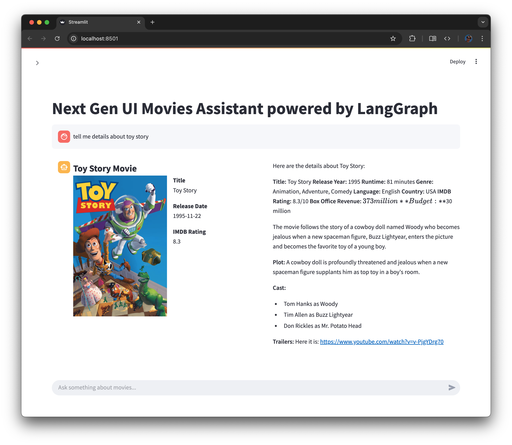

# Next Gen UI Examples

Repository contains apps how to use [Next Gen UI Agent](https://github.com/RedHat-UX/next-gen-ui-agent)

## Examples

* [assistent-ui](./assistant-ui/) - Standalone chat UI powered by [Assistent UI](https://www.assistant-ui.com/)
* [streamlit](./streamlit/) - Standalone chat UI powered by [Streamlit](https://streamlit.io/)

## Screenshots

### Next Gen UI & Streamlit & LangGraph

